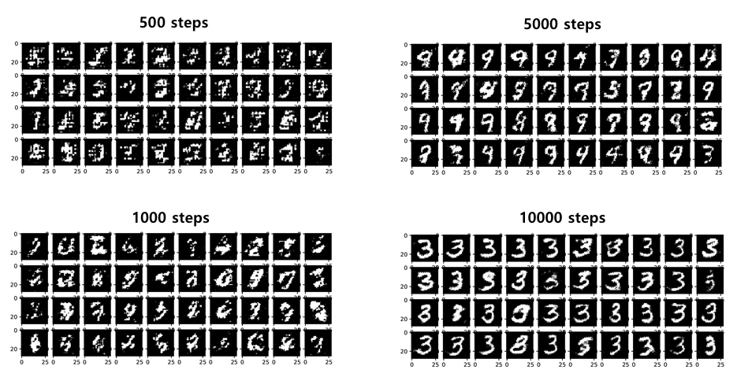

# DCGAN
Implementation of paper [Unsupervised Representation Learning with Deep Convolutional Generative Adversarial Networks](https://arxiv.org/abs/1511.06434) by Tensorflow.

## Requirements
 - [Tensorflow](http://www.tensorflow.org)
 - Matplotlib
 - Numpy

## Train and Test
**Usage**: `python dcgan.py`
**Result File**: PDF File(`result_(num_steps) steps.pdf`, ex: result_20000 steps.pdf) will be created when the training process finished. (Default `num_steps`: 20000)

