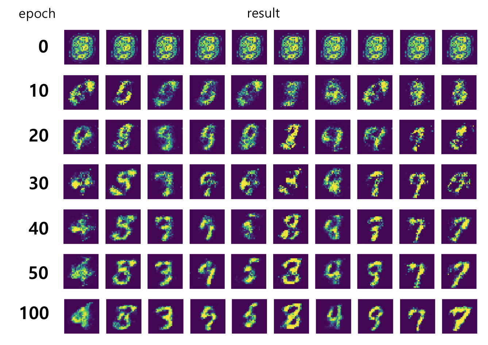

# OriginalGAN
Implementation of paper [Generative Adversarial Networks](https://arxiv.org/abs/1406.2661) by Tensorflow.

## Requirements
 - [Tensorflow](http://www.tensorflow.org)
 - Matplotlib
 - Numpy
 - python-tk

## Train and Test
**Usage**: `python gan.py`

**Result Image**: Result will be created in the `samples` folder every ten epoch.

